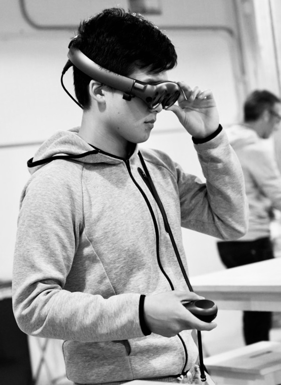

Stanford M.S. CS '19, B.S. Symbolic Systems '17

My dream is to use immersive technology to create and explore worlds totally different from our own&mdash;worlds with their own set of unique rules, assumptions, and norms. The experience of novel realities liberates us to re-witness our own world with fresh eyes. How better to appreciate up being up, and down being down, than to visit a world in which neither is true?
